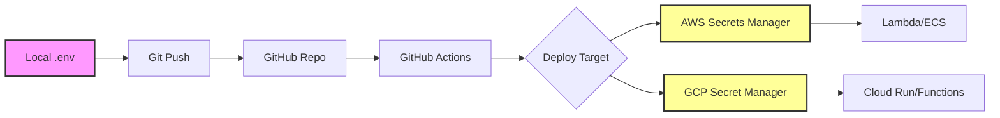

# Secrets Management Architecture

## Overview
For Local → GitHub → AWS/GCP deployment pipeline, removing API keys from the repository does NOT impact the architecture - it actually IMPROVES it by following security best practices.

## Architecture Components

### 1. Local Development
**Current Setup**: 
- API keys in `.env` file (gitignored)
- `load_env.sh` script loads keys into environment

**No Impact**: Works exactly the same with placeholder documentation

### 2. GitHub Repository
**Security Benefits**:
- ✅ No exposed credentials in code
- ✅ Clean public/private repository
- ✅ Complies with GitHub secret scanning
- ✅ Safe for open-source collaboration

**Secret Storage Options**:
```yaml
GitHub Secrets (Recommended):
- Repository Settings → Secrets → Actions
- Store each API key as a secret
- Reference in workflows: ${{ secrets.OPENAI_API_KEY }}
```

### 3. AWS Deployment
**Secret Management Services**:

#### AWS Secrets Manager (Recommended)
```bash
# Store secret
aws secretsmanager create-secret \
  --name prod/llm/openai-key \
  --secret-string "sk-proj-actual-key-here"

# Retrieve in application
import boto3
client = boto3.client('secretsmanager')
response = client.get_secret_value(SecretId='prod/llm/openai-key')
```

#### AWS Systems Manager Parameter Store
```bash
# Store as SecureString
aws ssm put-parameter \
  --name /llm/api/openai \
  --value "sk-proj-actual-key" \
  --type SecureString
```

#### Environment Variables (Lambda/ECS)
- Configure in AWS Console
- Or via CloudFormation/Terraform
- Never hardcode in deployment scripts

### 4. GCP Deployment
**Secret Management Services**:

#### Google Secret Manager (Recommended)
```bash
# Create secret
echo -n "sk-proj-actual-key" | gcloud secrets create openai-key --data-file=-

# Grant access
gcloud secrets add-iam-policy-binding openai-key \
  --member="serviceAccount:my-service@project.iam.gserviceaccount.com" \
  --role="roles/secretmanager.secretAccessor"
```

#### Environment Variables (Cloud Run/Functions)
```yaml
# In Cloud Run service YAML
env:
- name: OPENAI_API_KEY
  valueFrom:
    secretKeyRef:
      name: openai-key
      key: latest
```

## CI/CD Pipeline Architecture

### GitHub Actions → AWS
```yaml
name: Deploy to AWS
on:
  push:
    branches: [main]

jobs:
  deploy:
    runs-on: ubuntu-latest
    steps:
      - uses: actions/checkout@v2
      
      - name: Configure AWS credentials
        uses: aws-actions/configure-aws-credentials@v1
        with:
          aws-access-key-id: ${{ secrets.AWS_ACCESS_KEY_ID }}
          aws-secret-access-key: ${{ secrets.AWS_SECRET_ACCESS_KEY }}
          
      - name: Deploy with secrets
        env:
          OPENAI_API_KEY: ${{ secrets.OPENAI_API_KEY }}
          ANTHROPIC_API_KEY: ${{ secrets.ANTHROPIC_API_KEY }}
        run: |
          # Deploy script uses environment variables
          ./deploy-to-aws.sh
```

### GitHub Actions → GCP
```yaml
name: Deploy to GCP
on:
  push:
    branches: [main]

jobs:
  deploy:
    runs-on: ubuntu-latest
    steps:
      - uses: actions/checkout@v2
      
      - name: Setup Cloud SDK
        uses: google-github-actions/setup-gcloud@v0
        with:
          service_account_key: ${{ secrets.GCP_SA_KEY }}
          
      - name: Deploy with secrets
        run: |
          # Secrets pulled from GCP Secret Manager
          gcloud run deploy llm-service \
            --image gcr.io/project/llm-app \
            --set-secrets="OPENAI_API_KEY=openai-key:latest"
```

## Architecture Benefits

### Security Improvements
1. **Separation of Concerns**: Code vs. Configuration
2. **Audit Trail**: Secret access is logged
3. **Rotation**: Easy key rotation without code changes
4. **Access Control**: Granular permissions per environment

### Operational Benefits
1. **Multi-Environment**: Different keys for dev/staging/prod
2. **No Rebuilds**: Change keys without redeploying
3. **Compliance**: Meets security standards (SOC2, ISO 27001)

## Implementation Recommendations

### Phase 1: Local Development (Current)
- ✅ Use `.env` files
- ✅ Never commit secrets
- ✅ Document with placeholders

### Phase 2: GitHub Integration
- [ ] Add secrets to GitHub repository settings
- [ ] Create deployment workflows
- [ ] Use secret references in actions

### Phase 3: Cloud Deployment
- [ ] Choose secret manager (AWS Secrets Manager / GCP Secret Manager)
- [ ] Create IAM roles and policies
- [ ] Implement secret retrieval in application code
- [ ] Set up automatic rotation policies

### Phase 4: Production Hardening
- [ ] Enable secret versioning
- [ ] Implement break-glass procedures
- [ ] Set up monitoring and alerts
- [ ] Regular security audits

## Example: Complete Flow



## Security Best Practices

### DO ✅
- Store secrets in dedicated secret management services
- Use IAM roles instead of keys where possible
- Rotate keys regularly
- Use different keys per environment
- Monitor secret access
- Encrypt secrets at rest and in transit

### DON'T ❌
- Hardcode secrets in code
- Store secrets in git history
- Use the same keys across environments
- Share keys via email/slack
- Log secret values
- Store secrets in container images

## Migration Path

Since you've already removed keys from the repository, you're ready for the next steps:

1. **Immediate**: Continue using local `.env` file
2. **Next Sprint**: Add GitHub Secrets for CI/CD
3. **Before Production**: Implement cloud secret managers
4. **Production**: Full secret rotation and monitoring

## Conclusion

Removing API keys from your repository is the CORRECT first step for your Local → GitHub → AWS/GCP architecture. It enables:
- Secure CI/CD pipelines
- Proper secret management
- Compliance with best practices
- Scalable multi-environment deployments

The architecture remains the same - only the secret delivery mechanism improves.